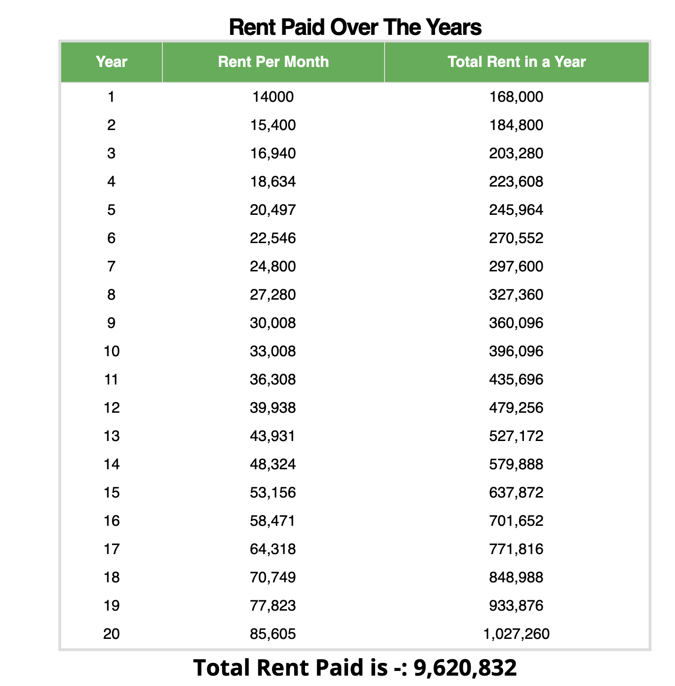

### Your house is a liability, your house is a liability.

You might have heard this from many people. There are many kinds of people who say this, but i have divided it into two categories. 

### 1. The New Financial Literates.

These are the kind of people who have finished reading a book like "Rich Dad Poor Dad" , and suddenly becomes financial experts and take the quotes from the book "House is a Liability". But, do you really know what is the business the author is doing. He is into Real Estate. He owns more than 3500 properties. Yeah, you heard it right , he owns more than 3500 liabilities. Now, comes the second type of people.

### 2. The Loan Phobia guys.

These are the people who will say that you don't own a home, you own a so much loan, you will hate yourself for rest of your life. Loan is a trap , its a monster , bla bla bla. But, do you know how much debt is in Reliance Industries , the company of Richest person in India. It has a debt of 1,54,478 crores as on 2019, at the time of writing this article. Yeah, you heard that right. Having a debt for starting something or for owning an asset which will put money in your pockets later, is really not such a bad idea.

There is one more kind of people, my favourite kind and because of whom , i have decided to write this blog, those who say that

### Renting is cheaper than owning.

Now, let us run some numbers and see if that is really true. I have two properties, one of which i believe is an asset , and other one is neither a liability , nor an asset. Let us crunch some numbers and see whether it is really an asset or a liability.

Now i bought a small full furnished 2 BHK house for 31 lakhs. After making a downpayment, and loan of 20 years, the monthly EMI comes at around 24k per month at current rate of interest. I get rent of around 14k per month by renting it out. 

I live in bangalore, and here rent increases by around 10% every 11 months , because every 11 months the rental agreement gets renewed. Now for the sake of calculation, lets assume , it gets renewed every year i.e in 12 months.
You can check the rent calculator from here [Rent Calculator](./rent-savings-calculator/)

Now, lets dig into the conclusions

* The EMI which is i am paying will remain almost the same, however the rent which will be asked will increase by 10% every year. 
* After 7 years , the rent which i receive will be greater than the EMI which i will be paying. 
* For the calculations perspective i have assumed 20 years , but even after finishing my loan , still i will be getting rent each year.

Apart from these things, there are also few other factors to consider 

* I will also get the tax benefits on the interest amount which i pay , as well as on the principal amount.
* If after 20 years i want to sell the apartment, i will be able to pay that for much appreciated value
* If the inflation is more the money which you borrowed from the bank at lower interest become more cheap , or deprecates in value, but the rents on the other hand increases as inflation increases.

### Yeah, yeah but what about the other things. There are always other things

* **Maintenance** After the tenant has moved in, he/she is responsible for maintaing the property. In my stay in rental properties, i have not seen any lanlord paying the maintenance after tenant has moved.
* **Cool Off Period** The tenant has to give you a notice of 1 month, this time is more than enough to find new tenants.
* **Damages** If there is any kind of damage to the property , that amount will be deducted from the Deposit

### Still, if you think a house is a liability , then think again. 

Is a rental property always a good option, or is any kind of investment in real estate always good. No, it is not. To be fair enough, lets look at the downside of owning a property

* If you want to start your own business at some point of time, after few years , then investing in property will not be a good option, because in the initial years , the money will go out of your pocket, cash flow will be outwards. It will be difficult to start something with EMIs going on.
* You need a high amount for downpayment.
* It is not as liquid as stocks, since it is not possible to sell it anytime whenever you want to.

